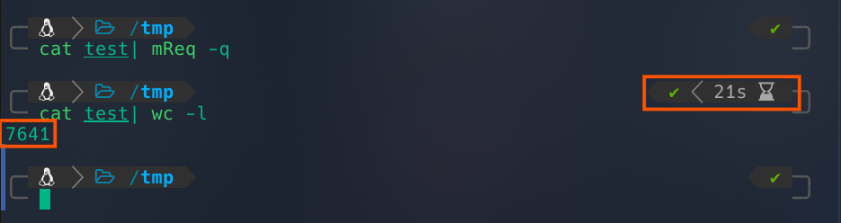

# mReq
make request fast

```bash
go install github.com/0xUN7H1NK4BLE/mReq/cmd/mReq@latest
```

# usages
```bash
echo <url> | mReq
cat file | mReq
cat file | mReq -q
mReq file
mReq file -q
```
## best uses
```bash
cat test | qsreplace <payload or url> | mReq
```



